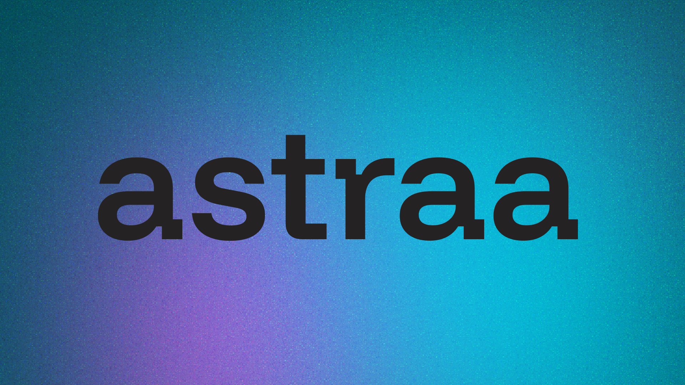

<p align="center">
  
</p>

<p align="center">
  A collection of helpful utility tools for developers and creators — runs entirely in your browser.
</p>

<p align="center">
  
  
  
</p>

---

## Quick Start

```bash
git clone https://github.com/puri-adityakumar/astraa.git
cd astraa
npm install
npm run dev
```

Open [http://localhost:3000](http://localhost:3000)

## Contributing

See [CONTRIBUTING.md](CONTRIBUTING.md) for guidelines.

## Support

If you find astraa useful, consider sponsoring the project ❤️

## License

 [MIT LICENSE](LICENSE)