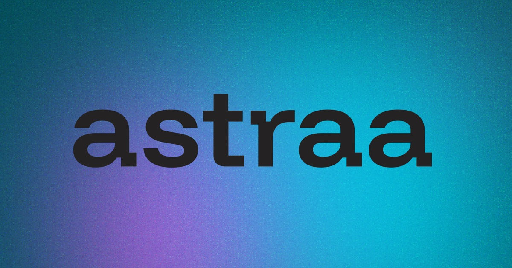

<p align="center">
  
</p>
<p align="center">
  
  
  
  
  
</p>

<h2 align="center">
  Astraa (अस्त्र) is a utility toolkit with focused browser tools and a clearly labelled roadmap for planned games.
</h2 >

**Project destinations:** [Docs](https://www.astraa.tech/docs) ·
[Roadmap](https://astraa.notion.site/roadmap) ·
[Changelog](https://astraa.notion.site/changelog) ·
[Hall of Fame](https://astraa.notion.site/documentation)

## Quick Start

### Prerequisites

- **Node.js**: v22 or higher
- **Package Manager**: npm

### Installation

1. **Clone the repository**

   ```bash
   git clone https://github.com/puri-adityakumar/astraa.git
   cd astraa
   ```

2. **Install dependencies**

   ```bash
   npm ci
   ```

3. **Start the development server**
   ```bash
   npm run dev
   ```

Open [http://localhost:3000](http://localhost:3000) to view the app.

## Documentation

Read the [public technical documentation](https://www.astraa.tech/docs), or review its canonical
[Markdown sources](https://github.com/puri-adityakumar/astraa/tree/development/docs) in this
repository.

## Contributing

See [CONTRIBUTING.md](CONTRIBUTING.md) for guidelines.

---

<p align="center">
  <i>"If you find astraa useful, consider sponsoring the project ❤️"</i>
</p>
