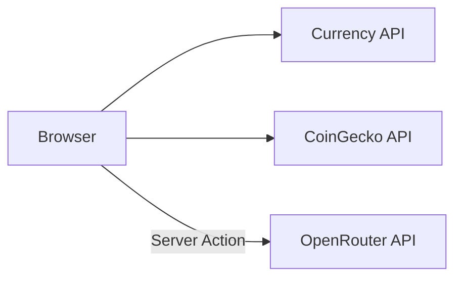

# API Documentation

External API integrations and server actions used in Astraa.

## Table of Contents

- [Overview](#overview)
- [Currency Exchange API](#currency-exchange-api)
- [Cryptocurrency API](#cryptocurrency-api)
- [AI Text Generation](#ai-text-generation)
- [Redis (Upstash)](#redis-upstash)
- [Error Handling](#error-handling)

## Overview

Astraa uses external APIs for live data. All API calls are made client-side or via server actions.



**No internal API routes** - the application is fully client-side with external integrations.

## Currency Exchange API

Real-time fiat currency conversion rates.

### Primary API

**Endpoint:** `https://cdn.jsdelivr.net/npm/@fawazahmed0/currency-api@latest/v1/currencies/{currency}.json`

**Method:** `GET`

**Rate Limits:** Unlimited (CDN-based)

### Usage

```typescript
import { getExchangeRate } from "@/lib/api"

// Get exchange rate from USD to EUR
const rate = await getExchangeRate("USD", "EUR")
// Returns: 0.92 (example)

// Convert amount
const amount = 100
const converted = amount * rate
// Returns: 92.00
```

### Implementation

```typescript
// lib/api.ts
export async function getExchangeRate(from: string, to: string): Promise<number> {
  const response = await fetch(
    `https://cdn.jsdelivr.net/npm/@fawazahmed0/currency-api@latest/v1/currencies/${from.toLowerCase()}.json`
  )

  if (!response.ok) {
    throw new Error("Failed to fetch rates")
  }

  const data = await response.json()
  return data[from.toLowerCase()][to.toLowerCase()]
}
```

### Response Format

```json
{
  "date": "2024-01-15",
  "usd": {
    "eur": 0.92,
    "gbp": 0.79,
    "jpy": 148.50
  }
}
```

### Fallback API

**Endpoint:** `https://api.exchangerate-api.com/v4/latest/{currency}`

Used automatically when the primary API fails.

```typescript
// Automatic fallback in getExchangeRate()
try {
  // Primary API call
} catch (error) {
  // Falls back to exchangerate-api.com
  const response = await fetch(`https://api.exchangerate-api.com/v4/latest/${from}`)
  const data = await response.json()
  return data.rates[to]
}
```

## Cryptocurrency API

Real-time cryptocurrency prices via CoinGecko.

### Endpoint

**Base URL:** `https://api.coingecko.com/api/v3`

**Authentication:** API key passed as query parameter

### Get Crypto Price

**Endpoint:** `/simple/price`

**Method:** `GET`

**Parameters:**

| Parameter | Type | Description |
|-----------|------|-------------|
| `ids` | string | Cryptocurrency ID (e.g., "bitcoin") |
| `vs_currencies` | string | Target currency (e.g., "usd") |

### Usage

```typescript
import { getCryptoPrice } from "@/lib/api"

// Get Bitcoin price in USD
const price = await getCryptoPrice("bitcoin", "USD")
// Returns: 45000.00 (example)

// Get Ethereum price in EUR
const ethPrice = await getCryptoPrice("ethereum", "EUR")
// Returns: 2100.00 (example)
```

### Implementation

```typescript
// lib/api.ts
const COINGECKO_API = "https://api.coingecko.com/api/v3"

export async function getCryptoPrice(
  cryptoId: string,
  currency: string
): Promise<number> {
  const response = await fetch(
    `${COINGECKO_API}/simple/price?ids=${cryptoId}&vs_currencies=${currency.toLowerCase()}&x_cg_demo_api_key=${API_KEY}`
  )
  const data = await response.json()
  return data[cryptoId][currency.toLowerCase()]
}
```

### Response Format

```json
{
  "bitcoin": {
    "usd": 45000.00
  }
}
```

### Supported Cryptocurrencies

| ID | Name |
|----|------|
| `bitcoin` | Bitcoin (BTC) |
| `ethereum` | Ethereum (ETH) |
| `tether` | Tether (USDT) |
| `binancecoin` | BNB |
| `solana` | Solana (SOL) |

Full list in `lib/crypto-data.ts`.

## AI Text Generation

Server action for generating contextual placeholder text via OpenRouter.

### Configuration

**Provider:** OpenRouter
**Model:** `meta-llama/llama-3.3-70b-instruct:free`
**Authentication:** Environment variable `OPENROUTER_API_KEY`

### Usage

```typescript
import { generateText } from "@/lib/openrouter"

// Generate text about a topic
const result = await generateText("artificial intelligence", 200)

if (result.success) {
  console.log(result.text)
} else {
  console.error(result.error)
}
```

### Implementation

```typescript
// lib/openrouter.ts
"use server"

import { OpenRouter } from "@openrouter/sdk"

export async function generateText(
  topic: string,
  wordCount: number
): Promise<TextGenerationResult> {
  const apiKey = process.env.OPENROUTER_API_KEY

  if (!apiKey) {
    return { success: false, error: "OPENROUTER_API_KEY is not configured." }
  }

  const openRouter = new OpenRouter({ apiKey })

  try {
    const completion = await openRouter.chat.send({
      model: "meta-llama/llama-3.3-70b-instruct:free",
      messages: [
        {
          role: "system",
          content: "You are a helpful assistant that generates meaningful placeholder text based on a topic."
        },
        {
          role: "user",
          content: `Generate approximately ${wordCount} words of text about "${topic}".`
        }
      ]
    })

    const text = completion.choices?.[0]?.message?.content

    if (!text) {
      throw new Error("No content received from API")
    }

    return { success: true, text }
  } catch (error) {
    return { success: false, error: "Failed to generate text." }
  }
}
```

### Response Types

```typescript
type TextGenerationResult =
  | { success: true; text: string }
  | { success: false; error: string }
```

### Parameters

| Parameter | Type | Description |
|-----------|------|-------------|
| `topic` | string | Subject for text generation |
| `wordCount` | number | Approximate word count |

## Redis (Upstash)

Server-side data persistence using Upstash Redis.

### Configuration

**Provider:** [Upstash](https://upstash.com)

**Package:** `@upstash/redis`

**Authentication:** Environment variables

```bash
# .env.local
UPSTASH_REDIS_REST_URL=your_redis_url
UPSTASH_REDIS_REST_TOKEN=your_redis_token
```

### Usage

```typescript
import { redis } from "@/lib/redis"

// Set a value
await redis.set("key", "value")

// Get a value
const value = await redis.get("key")

// Set with expiration (seconds)
await redis.set("key", "value", { ex: 3600 })
```

### Implementation

```typescript
// lib/redis.ts
import { Redis } from "@upstash/redis"

export const redis = new Redis({
  url: process.env.UPSTASH_REDIS_REST_URL!,
  token: process.env.UPSTASH_REDIS_REST_TOKEN!,
})
```

### Use Cases

- Activity tracking persistence
- Rate limiting
- Caching API responses
- Session data

## Error Handling

### API Error Pattern

```typescript
import { getUserFriendlyError, logError } from "@/lib/error-handler"
import { useToast } from "@/components/ui/use-toast"

export function CurrencyConverter() {
  const { toast } = useToast()

  async function handleConvert() {
    try {
      const rate = await getExchangeRate(from, to)
      setResult(amount * rate)
    } catch (error) {
      const details = getUserFriendlyError(error)
      toast({
        title: details.title,
        description: details.message,
        variant: "destructive"
      })
      logError(error, { context: "currency-conversion", from, to })
    }
  }
}
```

### Error Response Format

```typescript
interface ErrorDetails {
  title: string      // User-friendly title
  message: string    // User-friendly description
  code?: string      // Error code for debugging
}
```

### Network Error Handling

```typescript
// Automatic retry with fallback
export async function getExchangeRate(from: string, to: string) {
  try {
    // Primary API
    return await fetchPrimaryAPI(from, to)
  } catch (error) {
    console.error("Primary API failed:", error)
    try {
      // Fallback API
      return await fetchFallbackAPI(from, to)
    } catch (fallbackError) {
      console.error("Fallback API failed:", fallbackError)
      throw new Error("Failed to fetch exchange rate")
    }
  }
}
```

### Rate Limiting

| API | Rate Limit | Strategy |
|-----|-----------|----------|
| Currency API (CDN) | Unlimited | - |
| CoinGecko | 10-30 req/min | Demo key |
| OpenRouter | Varies by plan | Server-side only |

### Environment Variables

```bash
# .env.local
OPENROUTER_API_KEY=your_api_key_here
UPSTASH_REDIS_REST_URL=your_redis_url
UPSTASH_REDIS_REST_TOKEN=your_redis_token
```

| Variable | Required | Description |
|----------|----------|-------------|
| `OPENROUTER_API_KEY` | Optional | AI text generation |
| `UPSTASH_REDIS_REST_URL` | Optional | Redis database URL |
| `UPSTASH_REDIS_REST_TOKEN` | Optional | Redis authentication token |
