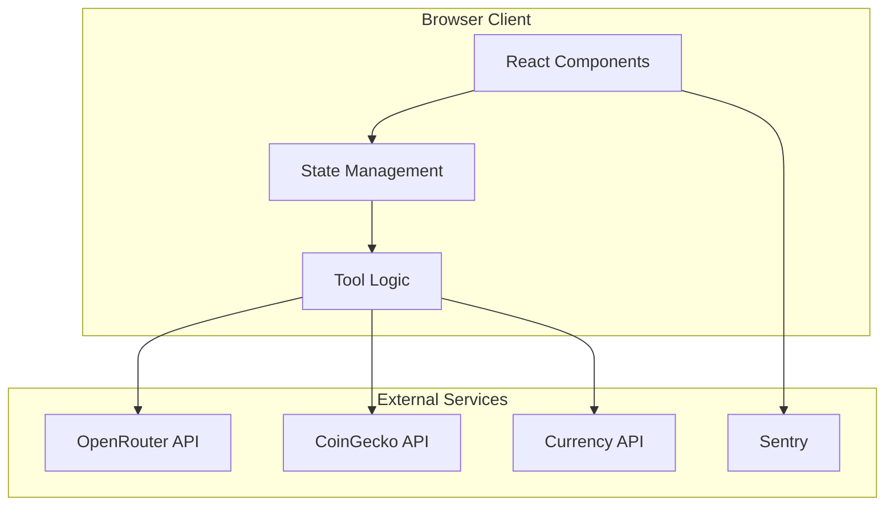
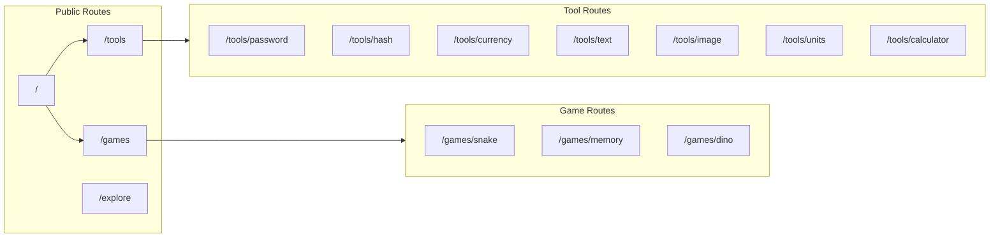
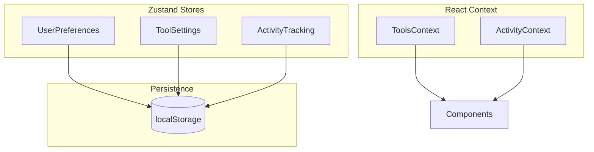
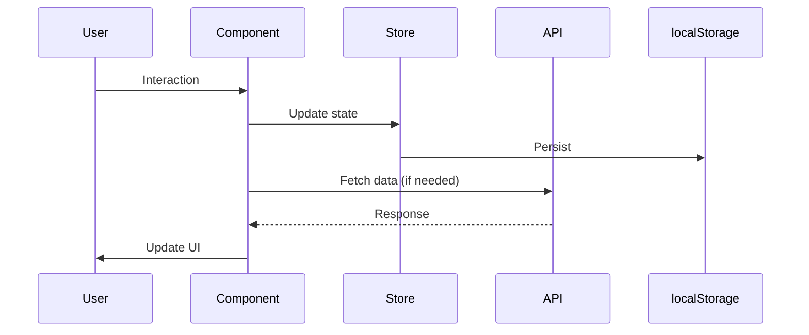
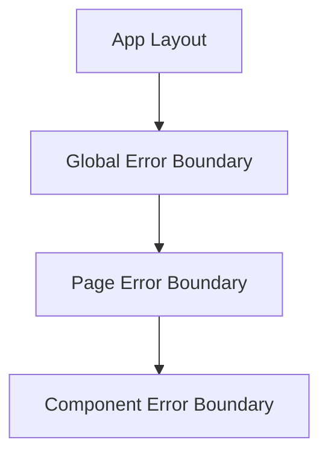
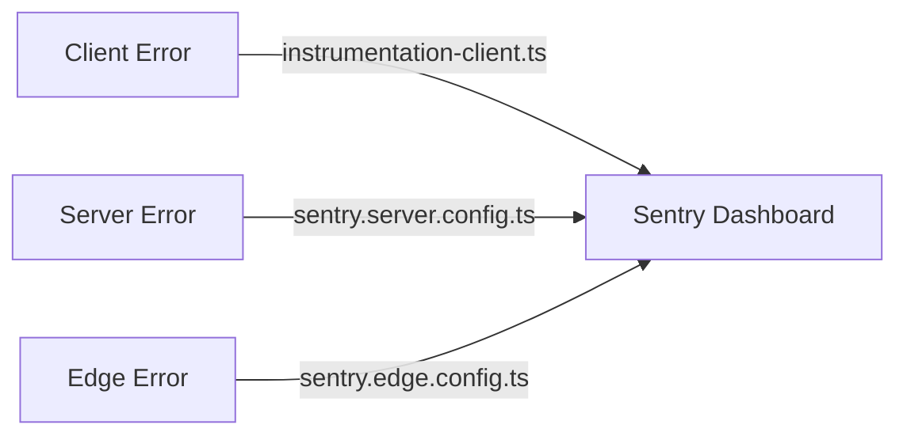

# Architecture

System architecture and design patterns for Astraa.

## Table of Contents

- [System Overview](#system-overview)
- [Frontend Structure](#frontend-structure)
- [Routing Architecture](#routing-architecture)
- [State Management](#state-management)
- [Data Flow](#data-flow)
- [Error Handling](#error-handling)

## System Overview



**Architecture Type:** Client-side rendered SPA with Next.js App Router

**Key Characteristics:**
- No backend API routes
- Browser-based processing for tools
- External APIs for live data
- Client-side state persistence

## Frontend Structure

```
app/
├── layout.tsx              # Root layout with providers
├── page.tsx                # Landing page
├── error.tsx               # Error boundary
├── not-found.tsx           # 404 page
├── tools/
│   ├── page.tsx            # Tools listing
│   ├── password/page.tsx   # Password generator
│   ├── hash/page.tsx       # Hash generator
│   ├── currency/page.tsx   # Currency converter
│   ├── text/page.tsx       # Text generator
│   ├── image/page.tsx      # Image resizer
│   ├── units/page.tsx      # Unit converter
│   ├── calculator/page.tsx # Calculator
│   └── ...
├── games/
│   ├── page.tsx            # Games listing
│   ├── snake/page.tsx      # Snake game
│   ├── memory/page.tsx     # Memory game
│   └── ...
└── explore/page.tsx        # Activity feed
```

### Page Component Pattern

Server component (page) renders client component:

```typescript
// app/tools/password/page.tsx (Server Component)
import { Metadata } from "next"
import { PasswordGenerator } from "@/components/password/password-generator"

export const metadata: Metadata = {
  title: "Password Generator | astraa",
  description: "Generate secure passwords"
}

export default function PasswordPage() {
  return <PasswordGenerator />
}
```

```typescript
// components/password/password-generator.tsx (Client Component)
"use client"

import { useState } from "react"
import { Button } from "@/components/ui/button"

export function PasswordGenerator() {
  const [password, setPassword] = useState("")
  // ...component logic
}
```

## Routing Architecture



**No authentication required** - all routes are public.

### Navigation Components

| Route Type | Navigation Component |
|------------|---------------------|
| Landing page | `LandingNavigation` (full header) |
| Tool/Game pages | `FloatingNavbar` (minimal) |

## State Management

### Architecture



### Zustand Stores

```typescript
// lib/stores/user-preferences.ts
interface UserPreferences {
  theme: 'light' | 'dark' | 'system'
  language: string
  accessibility: {
    reducedMotion: boolean
    highContrast: boolean
    fontSize: 'small' | 'medium' | 'large'
    screenReader: boolean
  }
  privacy: {
    analytics: boolean
    errorReporting: boolean
    cloudSync: boolean
    dataSharing: boolean
  }
  keyboardShortcuts: Record<string, string>
}
```

```typescript
// lib/stores/tool-settings.ts
interface ToolSettings {
  [toolId: string]: {
    lastUsed: number
    favorites: boolean
    customSettings: Record<string, unknown>
  }
}
```

### Context Providers

```typescript
// lib/tools-context.tsx
interface ToolsContextType {
  tools: Tool[]
  categories: string[]
  getToolsByCategory: (category: string) => Tool[]
  updateTool: (id: string, updates: Partial<Tool>) => void
}

// lib/activity-tracker.tsx
interface ActivityContextType {
  recentActivity: ActivityItem[]
  popularTools: PopularTool[]
  addActivity: (item: ActivityItem) => void
}
```

## Data Flow

### Tool Data Flow



### Example: Currency Converter

```typescript
// components/currency/fiat-converter.tsx
"use client"

import { useState, useEffect } from "react"
import { getExchangeRates } from "@/lib/api"

export function FiatConverter() {
  const [rates, setRates] = useState<ExchangeRates | null>(null)
  const [loading, setLoading] = useState(true)

  useEffect(() => {
    async function fetchRates() {
      try {
        const data = await getExchangeRates()
        setRates(data)
      } catch (error) {
        // Handle error
      } finally {
        setLoading(false)
      }
    }
    fetchRates()
  }, [])

  // Render logic
}
```

## Error Handling

### Error Boundary Structure



### Implementation

```typescript
// lib/error-handler.ts
export function getUserFriendlyError(error: unknown): ErrorDetails {
  // Sanitize and format error for user display
  return {
    title: "Something went wrong",
    message: sanitizedMessage,
    code: errorCode
  }
}

export function logError(error: unknown, context?: Record<string, unknown>) {
  // Log to Sentry with context
  Sentry.captureException(error, { extra: context })
}
```

```typescript
// Usage in components
try {
  await riskyOperation()
} catch (error) {
  const details = getUserFriendlyError(error)
  toast({
    title: details.title,
    description: details.message,
    variant: "destructive"
  })
  logError(error, { context: "currency-conversion" })
}
```

### Sentry Integration



**Configuration:**
- Trace sample rate: 100% (development)
- Session replay: 10% normal, 100% on error
- Source maps uploaded for debugging
