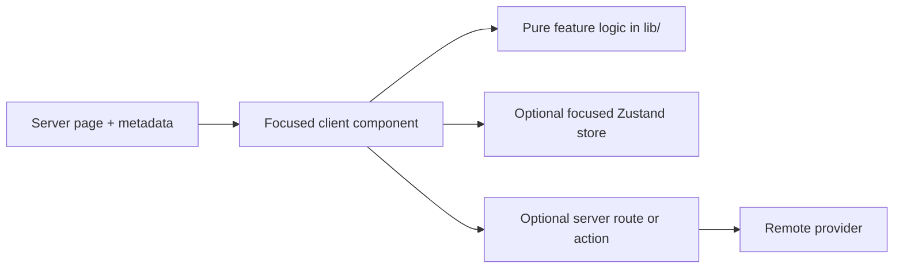

# Architecture

Astraa is a Next.js App Router application built around small browser tools,
server-owned remote resources, and explicit feature boundaries.

## Rendering and feature boundary


```mermaid
flowchart LR
  Page["Server page + metadata"] --> Client["Focused client component"]
  Client --> Logic["Pure feature logic in lib/"]
  Client --> Store["Optional focused Zustand store"]
  Client --> Resource["Optional server route or action"]
  Resource --> Provider["Remote provider"]
```

The default tool shape is:

```text
app/tools/example/page.tsx
components/example/example-client.tsx
lib/example/
```

Interactive games follow the same boundary with `app/games/<game>/`, a focused
client under `components/games/`, and a framework-free engine under
`lib/games/<game>/`. Memory uses component-local state; only its cancellable
resolution delay touches a browser timer.

Server pages own route metadata and render client components only when browser
interactivity is required. Pure parsing, conversion, validation, and formatting
logic stays under `lib/` and receives unit tests.

## Registries and availability

`lib/tools.ts` and `lib/games.ts` are immutable registries. Catalogs, metadata,
the sitemap, related links, and the command menu consume their stable IDs,
canonical paths, `status`, and `processing` fields directly. `coming-soon`
entries remain noninteractive, noindex, and absent from the sitemap.

Incomplete public ideas stay fail-closed through their route and registry state.
Implementation code is added only within a committed launch plan; hidden game
prototypes do not receive permanent Knip exemptions.

## State and persistence

Global presentation state is limited to `next-themes` and component-local
state. JSON, Markdown, regex, and snippet tools use focused Zustand stores in
`lib/stores/`.

Persisted stores use `createZustandStorage()`:

- SSR receives a safe no-op adapter;
- the browser prefers IndexedDB;
- localStorage is the fallback;
- operations are serialized per key;
- failures leave the editor usable in memory;
- each store owns its schema version and migration.

There is no global activity, preferences, visitor, or tool-usage store.

## Remote data

Provider credentials never enter the client bundle.

- Crypto rates pass through `/api/rates/crypto` and CoinGecko.
- Fiat rates pass through `/api/rates/fiat` with a fallback provider.
- AI text uses the `generateText` server action and a server-side rate limiter.
- GitHub contributors are fetched and cached by a server-only helper.

Browser rate requests are keyed by pair, bounded, TTL-based, deduplicated, and
abortable. The UI derives converted amounts locally so typing does not refetch.

## Errors, privacy, and observability

Memory game state is ephemeral and local: it is not persisted, sent to a
provider, or recorded as product telemetry.

`lib/error-handler.ts` maps unknown failures to stable public errors.
`lib/observability/` sanitizes diagnostic messages, context, breadcrumbs, and
Sentry events before reporting. Tool input, credentials, request bodies,
clipboard data, URLs with query details, email addresses, IP addresses, and
file paths are redacted.

Sentry remains disabled unless both a DSN and environment are configured.
Session replay, logs, and default PII collection are disabled. Vercel Analytics
and Speed Insights load only in production and can be omitted at build time with
`ASTRAA_ENABLE_ANALYTICS=false`.

There is no homepage visitor counter, visitor cookie, or stats endpoint.
Upstash is used only for the configured public AI-action rate limiter.

## Documentation rendering

`lib/docs/catalog.json` explicitly maps each public documentation route to a
tracked Markdown source. Its browser-safe typed wrapper supplies navigation and
sitemap paths, while a server-only loader resolves source keys through a fixed
allowlist of absolute files instead of joining request-controlled paths.

Documentation pages server-render GitHub Flavored Markdown and math while
skipping raw HTML. Mermaid fences are the only strict optional client island:
they enhance lazily and keep their readable source visible during loading,
failure, retry, and JavaScript-disabled browsing.

## SEO and accessibility

Route pages export metadata with canonical URLs, descriptions, social cards,
and indexability matching route availability. Root metadata supplies the site
identity and structured data. `robots.ts` allows public crawling and disallows
`/api/`. Only `sitemap.ts` consumes `getIndexablePaths()`, which combines static
public pages, `DOCS_PATHS`, available tool paths, and games when their explicit
indexing gate is enabled.

The root layout provides a skip link, semantic main landmark, theme support,
tooltips, toasts, navigation, and footer. Interactive components must keep
44-pixel touch targets, keyboard access, visible focus, screen-reader status
updates, and reduced-motion behavior.

## Quality gates

The repository enforces TypeScript strictness, ESLint, Vitest, Knip, a clean npm
dependency graph, and a production build. Worker files, framework conventions,
and deliberate follow-up clients are declared in `knip.jsonc`; other unused
files or dependencies are failures.
