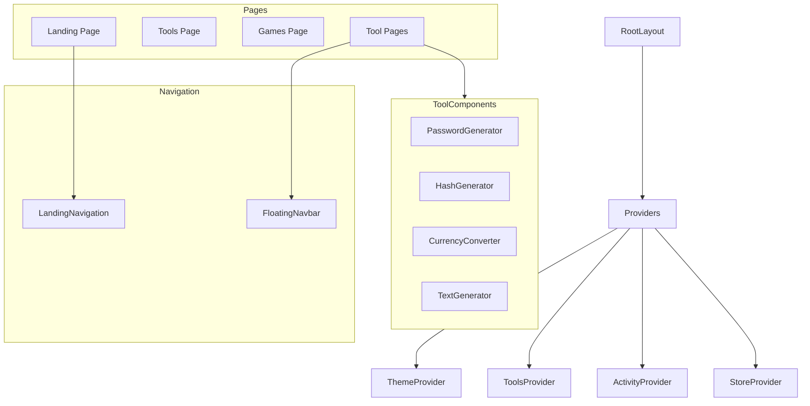

# Components Documentation

React component hierarchy, hooks, and usage patterns for Astraa.

## Table of Contents

- [Component Hierarchy](#component-hierarchy)
- [Layout Components](#layout-components)
- [Tool Components](#tool-components)
- [UI Components](#ui-components)
- [Custom Hooks](#custom-hooks)
- [Context Providers](#context-providers)

## Component Hierarchy



## Layout Components

### RootLayout

Root layout with all providers and global elements.

```typescript
// app/layout.tsx
import { ThemeProvider } from "@/components/theme-provider"
import { ToolsProvider } from "@/lib/tools-context"
import { ActivityProvider } from "@/lib/activity-tracker"
import { Toaster } from "@/components/ui/toaster"

export default function RootLayout({ children }: { children: React.ReactNode }) {
  return (
    <html lang="en" suppressHydrationWarning>
      <body>
        <ThemeProvider attribute="class" defaultTheme="system" enableSystem>
          <ToolsProvider>
            <ActivityProvider>
              {children}
              <Toaster />
            </ActivityProvider>
          </ToolsProvider>
        </ThemeProvider>
      </body>
    </html>
  )
}
```

### Navigation

Route-aware navigation wrapper.

```typescript
// components/navigation.tsx
"use client"

import { usePathname } from "next/navigation"
import { LandingNavigation } from "@/components/home/landing-navigation"
import { FloatingNavbar } from "@/components/ui/floating-navbar"

export function Navigation() {
  const pathname = usePathname()
  const isLandingPage = pathname === "/"

  if (isLandingPage) {
    return <LandingNavigation />
  }

  return <FloatingNavbar />
}
```

### FloatingNavbar

Minimal navigation for tool and game pages.

**Location:** `components/ui/floating-navbar.tsx`

**Usage:**
```tsx
<FloatingNavbar />
```

**Features:**
- Compact design for tool focus
- Theme toggle
- Home navigation
- Command menu trigger

## Tool Components

### PasswordGenerator

Secure password generation with multiple modes.

**Location:** `components/password/password-generator.tsx`

**Props:** None (self-contained)

**Usage:**
```tsx
import { PasswordGenerator } from "@/components/password/password-generator"

export default function PasswordPage() {
  return <PasswordGenerator />
}
```

**Sub-components:**
- `PasswordOptions` - Configuration controls
- `PasswordDisplay` - Result display with copy functionality
- `PasswordStrength` - Visual strength indicator

### HashGenerator

Multi-algorithm hash generation.

**Location:** `components/hash/hash-generator.tsx`

**Sub-components:**

```typescript
// components/hash/hash-input.tsx
interface HashInputProps {
  value: string
  onChange: (value: string) => void
}

export function HashInput({ value, onChange }: HashInputProps) {
  return (
    <Textarea
      placeholder="Enter text to hash..."
      value={value}
      onChange={(e) => onChange(e.target.value)}
    />
  )
}
```

```typescript
// components/hash/hash-selector.tsx
interface HashSelectorProps {
  algorithm: HashAlgorithm
  onSelect: (algorithm: HashAlgorithm) => void
}

export function HashSelector({ algorithm, onSelect }: HashSelectorProps) {
  return (
    <Select value={algorithm} onValueChange={onSelect}>
      <SelectTrigger>
        <SelectValue />
      </SelectTrigger>
      <SelectContent>
        <SelectItem value="md5">MD5</SelectItem>
        <SelectItem value="sha1">SHA-1</SelectItem>
        <SelectItem value="sha256">SHA-256</SelectItem>
        <SelectItem value="sha512">SHA-512</SelectItem>
      </SelectContent>
    </Select>
  )
}
```

### CurrencyConverter

Fiat and cryptocurrency conversion.

**Location:** `components/currency/`

**Components:**
- `FiatConverter` - Traditional currency conversion
- `CryptoConverter` - Cryptocurrency conversion
- `CurrencySelect` - Currency picker dropdown
- `CryptoSelect` - Crypto picker dropdown

```typescript
// components/currency/fiat-converter.tsx
"use client"

import { useState, useEffect } from "react"
import { getExchangeRate } from "@/lib/api"
import { CurrencySelect } from "./currency-select"

export function FiatConverter() {
  const [from, setFrom] = useState("USD")
  const [to, setTo] = useState("EUR")
  const [amount, setAmount] = useState(100)
  const [result, setResult] = useState<number | null>(null)

  async function convert() {
    const rate = await getExchangeRate(from, to)
    setResult(amount * rate)
  }

  return (
    <div className="space-y-4">
      <CurrencySelect value={from} onChange={setFrom} />
      <Input
        type="number"
        value={amount}
        onChange={(e) => setAmount(Number(e.target.value))}
      />
      <CurrencySelect value={to} onChange={setTo} />
      <Button onClick={convert}>Convert</Button>
      {result && <p>{result.toFixed(2)}</p>}
    </div>
  )
}
```

## UI Components

Shadcn/UI components in `components/ui/`.

### Button

```typescript
import { Button } from "@/components/ui/button"

// Variants
<Button variant="default">Primary</Button>
<Button variant="secondary">Secondary</Button>
<Button variant="destructive">Destructive</Button>
<Button variant="outline">Outline</Button>
<Button variant="ghost">Ghost</Button>
<Button variant="link">Link</Button>

// Sizes
<Button size="default">Default</Button>
<Button size="sm">Small</Button>
<Button size="lg">Large</Button>
<Button size="icon">Icon</Button>
```

### Input

```typescript
import { Input } from "@/components/ui/input"

<Input
  type="text"
  placeholder="Enter value..."
  value={value}
  onChange={(e) => setValue(e.target.value)}
/>
```

### Select

```typescript
import {
  Select,
  SelectContent,
  SelectItem,
  SelectTrigger,
  SelectValue
} from "@/components/ui/select"

<Select value={value} onValueChange={setValue}>
  <SelectTrigger>
    <SelectValue placeholder="Select option" />
  </SelectTrigger>
  <SelectContent>
    <SelectItem value="option1">Option 1</SelectItem>
    <SelectItem value="option2">Option 2</SelectItem>
  </SelectContent>
</Select>
```

### Card

```typescript
import {
  Card,
  CardContent,
  CardDescription,
  CardFooter,
  CardHeader,
  CardTitle
} from "@/components/ui/card"

<Card>
  <CardHeader>
    <CardTitle>Card Title</CardTitle>
    <CardDescription>Card description</CardDescription>
  </CardHeader>
  <CardContent>
    <p>Card content</p>
  </CardContent>
  <CardFooter>
    <Button>Action</Button>
  </CardFooter>
</Card>
```

### Toast

```typescript
import { useToast } from "@/hooks/use-toast"

export function MyComponent() {
  const { toast } = useToast()

  function handleSuccess() {
    toast({
      title: "Success",
      description: "Operation completed"
    })
  }

  function handleError() {
    toast({
      title: "Error",
      description: "Something went wrong",
      variant: "destructive"
    })
  }
}
```

## Custom Hooks

### useToast

Toast notification management.

**Location:** `hooks/use-toast.ts`

```typescript
import { useToast } from "@/hooks/use-toast"

export function MyComponent() {
  const { toast, dismiss } = useToast()

  // Show toast
  const { id } = toast({
    title: "Notification",
    description: "This is a message",
    variant: "default" // or "destructive"
  })

  // Dismiss specific toast
  dismiss(id)

  // Dismiss all toasts
  dismiss()
}
```

### useTools

Access tools catalog from context.

**Location:** `lib/tools-context.tsx`

```typescript
import { useTools } from "@/lib/tools-context"

export function ToolsList() {
  const { tools, categories, updateTools } = useTools()

  return (
    <div>
      {categories.map((category) => (
        <div key={category.name}>
          <h2>{category.name}</h2>
          {category.items.map((tool) => (
            <ToolCard key={tool.path} tool={tool} />
          ))}
        </div>
      ))}
    </div>
  )
}
```

### useUserPreferences

Zustand store for user settings.

**Location:** `lib/stores/user-preferences.ts`

```typescript
import { useUserPreferences } from "@/lib/stores"

export function SettingsPanel() {
  const {
    theme,
    setTheme,
    accessibility,
    updateAccessibility,
    privacy,
    updatePrivacy
  } = useUserPreferences()

  return (
    <div>
      <Select value={theme} onValueChange={setTheme}>
        <SelectItem value="light">Light</SelectItem>
        <SelectItem value="dark">Dark</SelectItem>
        <SelectItem value="system">System</SelectItem>
      </Select>

      <Switch
        checked={accessibility.reducedMotion}
        onCheckedChange={(checked) =>
          updateAccessibility({ reducedMotion: checked })
        }
      />
    </div>
  )
}
```

### useReducedMotion

Respect user motion preferences.

**Location:** `lib/animations/hooks.ts`

```typescript
import { useReducedMotion } from "@/lib/animations/hooks"
import { fadeInUp } from "@/lib/animations/variants"

export function AnimatedCard() {
  const shouldReduce = useReducedMotion()

  return (
    <motion.div
      variants={shouldReduce ? {} : fadeInUp}
      initial="hidden"
      animate="show"
    >
      Content
    </motion.div>
  )
}
```

### Game Hooks

#### useSnakeGame

Snake game state management.

**Location:** `lib/games/snake/useSnakeGame.ts`

```typescript
import { useSnakeGame } from "@/lib/games/snake/useSnakeGame"

export function SnakeGame() {
  const { gameState, resetGame, GRID_SIZE } = useSnakeGame()

  return (
    <div>
      <p>Score: {gameState.score}</p>
      {gameState.isGameOver && (
        <Button onClick={resetGame}>Play Again</Button>
      )}
      <GameBoard
        snake={gameState.snake}
        food={gameState.food}
        gridSize={GRID_SIZE}
      />
    </div>
  )
}
```

**Returns:**
```typescript
interface SnakeGameReturn {
  gameState: {
    snake: Array<{ x: number; y: number }>
    food: { x: number; y: number }
    direction: "UP" | "DOWN" | "LEFT" | "RIGHT"
    isGameOver: boolean
    score: number
  }
  resetGame: () => void
  GRID_SIZE: number
}
```

#### useMemoryGame

Memory card game logic.

**Location:** `lib/games/memory/useMemoryGame.ts`

```typescript
import { useMemoryGame } from "@/lib/games/memory/useMemoryGame"

export function MemoryGame() {
  const { cards, flippedCards, flipCard, resetGame, moves, isComplete } =
    useMemoryGame()

  return (
    <div>
      <p>Moves: {moves}</p>
      {isComplete && <Button onClick={resetGame}>Play Again</Button>}
      <div className="grid grid-cols-4 gap-2">
        {cards.map((card, index) => (
          <Card
            key={index}
            card={card}
            isFlipped={flippedCards.includes(index)}
            onClick={() => flipCard(index)}
          />
        ))}
      </div>
    </div>
  )
}
```

## Context Providers

### ToolsProvider

Provides tools catalog to the component tree.

**Location:** `lib/tools-context.tsx`

```typescript
// lib/tools-context.tsx
"use client"

import { createContext, useContext, useState } from "react"
import { tools, toolCategories, type Tool, type ToolCategory } from "./tools"

interface ToolsContextType {
  tools: Tool[]
  categories: ToolCategory[]
  updateTools: (newTools: Tool[]) => void
  updateCategories: (newCategories: ToolCategory[]) => void
}

const ToolsContext = createContext<ToolsContextType | null>(null)

export function ToolsProvider({ children }: { children: React.ReactNode }) {
  const [currentTools, setCurrentTools] = useState(tools)
  const [currentCategories, setCurrentCategories] = useState(toolCategories)

  return (
    <ToolsContext.Provider
      value={{
        tools: currentTools,
        categories: currentCategories,
        updateTools: setCurrentTools,
        updateCategories: setCurrentCategories
      }}
    >
      {children}
    </ToolsContext.Provider>
  )
}

export function useTools() {
  const context = useContext(ToolsContext)
  if (!context) {
    throw new Error("useTools must be used within a ToolsProvider")
  }
  return context
}
```

### StoreProvider

Zustand stores provider with hydration handling.

**Location:** `lib/stores/provider.tsx`

```typescript
import { StoreProvider } from "@/lib/stores"

export default function RootLayout({ children }: { children: React.ReactNode }) {
  return (
    <StoreProvider>
      {children}
    </StoreProvider>
  )
}
```

### ThemeProvider

Next-themes integration for dark mode.

**Location:** `components/theme-provider.tsx`

```typescript
import { ThemeProvider } from "@/components/theme-provider"

<ThemeProvider
  attribute="class"
  defaultTheme="system"
  enableSystem
  disableTransitionOnChange
>
  {children}
</ThemeProvider>
```

## Type Definitions

### Tool Type

```typescript
// lib/tools.ts
import type { LucideIcon } from "lucide-react"

export type Tool = {
  name: string
  description: string
  path: string
  icon: LucideIcon
  wip?: boolean
  comingSoon?: boolean
}

export type ToolCategory = {
  name: string
  items: Tool[]
}
```

### Store Types

```typescript
// lib/stores/types.ts
export interface UserPreferences {
  theme: "light" | "dark" | "system"
  language: string
  accessibility: AccessibilitySettings
  privacy: PrivacySettings
  keyboardShortcuts: Record<string, string>
}

export interface AccessibilitySettings {
  reducedMotion: boolean
  highContrast: boolean
  fontSize: "small" | "medium" | "large"
  screenReader: boolean
}

export interface PrivacySettings {
  analytics: boolean
  errorReporting: boolean
  cloudSync: boolean
  dataSharing: boolean
}
```
