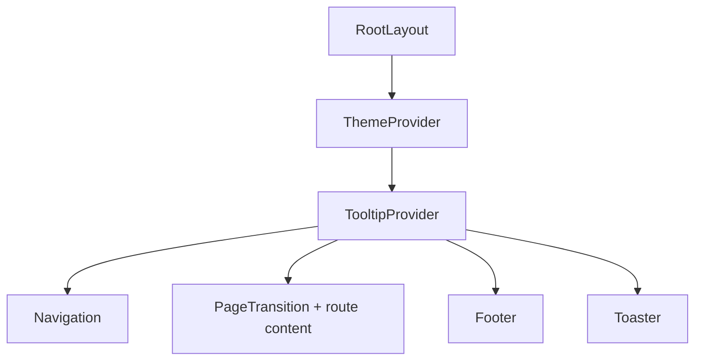

# Component guide

Astraa components are feature-focused and reuse the small primitive set under
`components/ui/`.

## Root composition

`app/layout.tsx` renders this stable shell:


```mermaid
flowchart TD
  Root["RootLayout"] --> Theme["ThemeProvider"]
  Theme --> Tooltip["TooltipProvider"]
  Tooltip --> Navigation
  Tooltip --> Main["PageTransition + route content"]
  Tooltip --> Footer
  Tooltip --> Toaster
```

Analytics and Speed Insights are conditional production children. The root does
not mount registry, activity, or Zustand providers.

## Tool pages

A tool page normally owns unbranded metadata and renders one focused client component only
when browser interaction is required. The client owns UI state and event wiring; reusable
parsing, validation, formatting, and conversion logic stays in the corresponding `lib/`
module. The tracked
[feature workflow](https://github.com/puri-adityakumar/astraa/blob/development/.agents/skills/astraa-feature-workflow/SKILL.md)
owns the complete implementation procedure.

## Catalog components

`components/command-menu.tsx`, `components/tools/tools-client.tsx`, and
`components/explore/explore-client.tsx` import `toolCategories`, `tools`, and
`games` directly from their registry modules. Treat those arrays as immutable.
Availability badges and disabled navigation come from registry flags rather
than duplicated component state.

## Focused editor stores

JSON, Markdown, regex, and snippet components select state directly from their
own store modules:

```typescript
import { useRegexTester } from "@/lib/stores/regex-tester";

const pattern = useRegexTester((state) => state.pattern);
const setPattern = useRegexTester((state) => state.setPattern);
```

Avoid subscribing to a complete store when a selector is sufficient. Do not
add a root store provider or generic usage-tracking store.

## Remote-resource components

Currency components use `useExchangeRate(kind, base, quote)`. They should:

- fetch when the normalized pair changes, not when the amount changes;
- derive converted values locally;
- expose loading, refreshing, error, retry, and timestamp states;
- preserve the last valid rate during a refresh;
- announce meaningful status changes with an appropriate live region.

Contributor UI receives server-fetched data as props. It must not issue a
duplicate client-side GitHub request.

## UI primitives

Use an existing primitive from `components/ui/` before adding one. The current
set is intentionally limited to primitives with production consumers. Their
complete exported API is treated as the local design-system surface in Knip.

Compose conditional classes through `cn()` and keep Tailwind order as layout,
spacing, sizing, typography, color, border, effects, state, then responsive
variants.

## Motion

Shared motion is limited to the variants in `lib/animations/variants.ts`. Every
animated client checks `useReducedMotion()`:

```typescript
import { motion } from "framer-motion";

import { useReducedMotion } from "@/lib/animations/hooks";
import { fadeInUp } from "@/lib/animations/variants";

const shouldReduce = useReducedMotion();

return (
  <motion.div
    variants={shouldReduce ? {} : fadeInUp}
    initial="hidden"
    animate="show"
  />
);
```

## Errors and feedback

Expected validation errors belong beside the related control. Unexpected
failures use `getUserFriendlyError()` for user copy and `logError()` for a
sanitized diagnostic. Toasts are appropriate for short action feedback; they
do not replace persistent error states or accessible labels.

## Accessibility checklist

- Use semantic buttons, inputs, labels, headings, and landmarks.
- Keep pointer targets at least 44 by 44 pixels.
- Add `aria-label` to icon-only controls.
- Make every action keyboard reachable and keep visible focus.
- Move focus or announce content when a state change would otherwise be silent.
- Respect reduced motion and avoid animation-only meaning.
- Give images meaningful alternative text or an empty alt when decorative.
